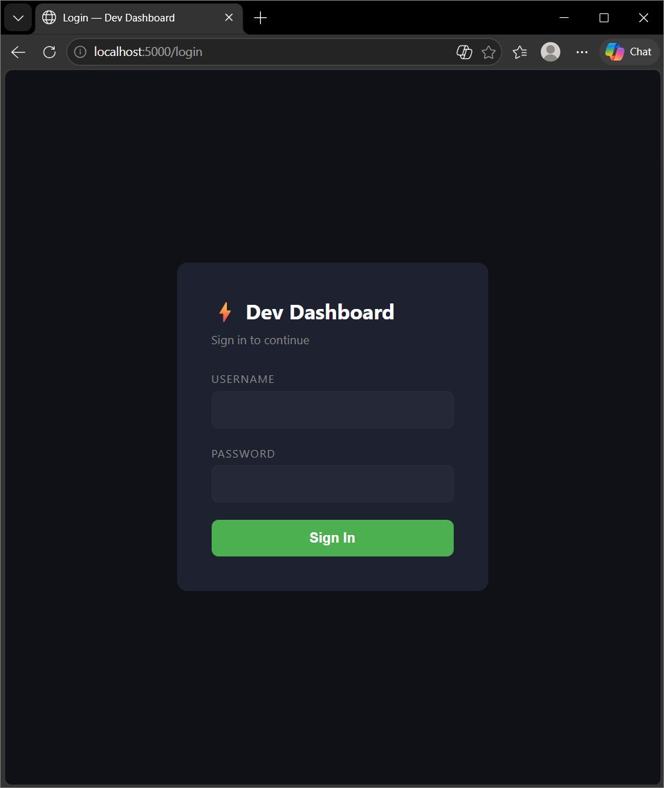
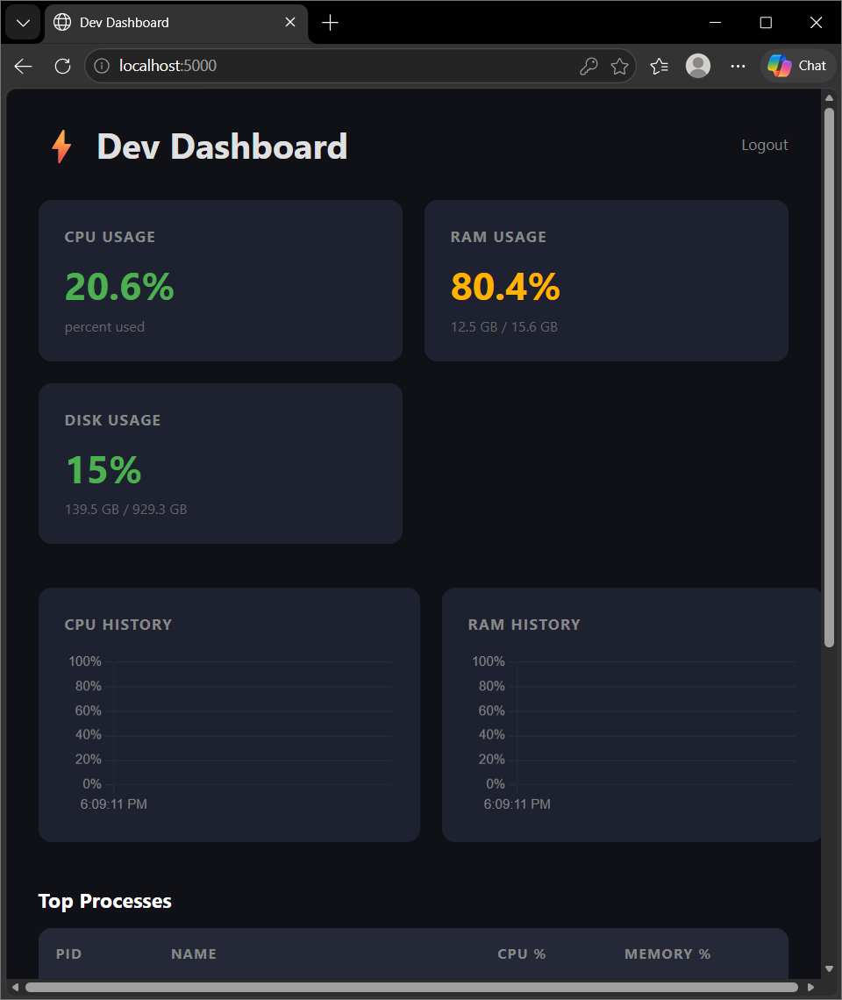

# Dev Dashboard

A lightweight, self-hosted system monitoring dashboard built with Python and Flask.
Displays real-time CPU, RAM, and disk usage alongside a live process table — all in a clean dark-themed web UI.

## Screenshots

### Login

### Dashboard

## Features

- Live CPU, RAM, and disk usage with color-coded indicators
- Live rolling charts for CPU and RAM history
- Top 10 processes by CPU usage
- Auto-refreshes every 5 seconds
- Login page with session authentication
- Desktop alerts when CPU or RAM exceeds 85%
- Clean dark-themed responsive UI
- Lightweight — no heavy frameworks or databases

## Tech Stack

- **Backend:** Python, Flask, psutil, plyer
- **Frontend:** HTML, CSS, Vanilla JavaScript, Chart.js

## Getting Started

### Prerequisites
- Python 3.x
- pip

### Installation

1. Clone the repo
git clone https://github.com/BenLudowise/dev-dashboard.git
cd dev-dashboard

2. Create and activate a virtual environment
python -m venv venv
venv\Scripts\activate

3. Install dependencies
pip install -r requirements.txt

4. Run the app
python app.py

5. Open your browser and go to `http://localhost:5000`

6. Login with the default credentials and change them in `app.py`

## Default Credentials
Username: admin
Password: password123

> ⚠️ Change these in `app.py` before deploying anywhere publicly accessible.

## Project Structure
dev-dashboard/
├── app.py              # Flask backend & API routes
├── requirements.txt    # Python dependencies
├── templates/
│   └── index.html      # Frontend dashboard
└── static/             # Static assets (future use)

## Roadmap

- [x] Flask REST API for system stats
- [x] Live-updating frontend dashboard
- [x] Historical charts with Chart.js
- [x] Desktop alerts on high CPU/RAM usage
- [x] Login/authentication
- [ ] One-click deployment script
- [ ] Deploy to VPS

## License

MIT
